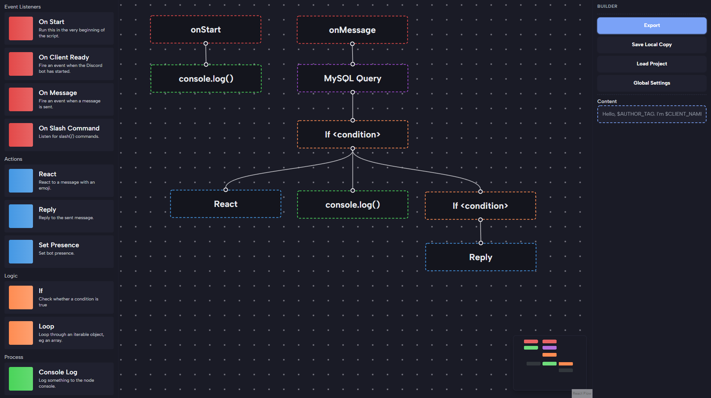

# Hydrazine [In Development]

- [Documentations](./docs/README.MD)
- [Downloads](https://github.com/jareer12/hydrazine/releases)

**Hydrazine** is a tool for non-coders to create Discord bots by placing visual blocks. Hydrazine is Built with [Tauri](https://tauri.app/) and [React Flow](https://reactflow.dev/). 

 
