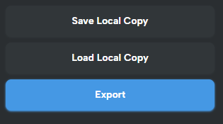

# Save Locally

If you click(focus) on a node in the Builder, it'll show you a panel on the right, There you'll see three buttons. A local copy of the project is called a **Hydro**. A Hydro file ends with `.hydro`.

- `Save Local Copy`. Saves the project to a local file.
- `Load Project`. Load project from the locally saved file
- `Export`. Exports the project to a zip file.

